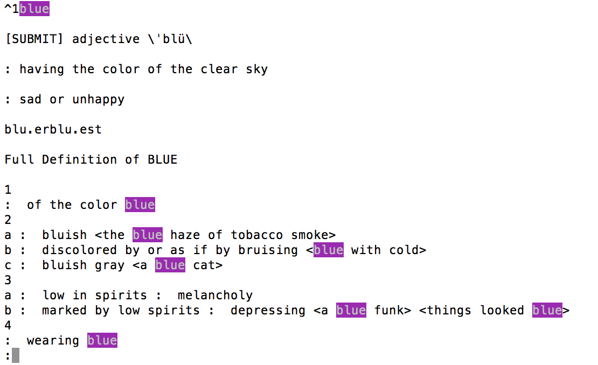

# コマンドライン英英辞書(mw)

コマンドラインからオンラインのmerriam-webster英英辞書の検索結果を見ることができるようにするスクリプトです．**MacOSX**でなるべくインストールするコマンドが無いようにしました．必要なのは**w3m**だけだと思います．

* merriam-webster英英
[http://www.collinsdictionary.com/dictionary/english-cobuild-learners/english](http://www.collinsdictionary.com/dictionary/english-cobuild-learners/english)
[http://www.merriam-webster.com](http://www.merriam-webster.com)
* こちらがを参考にしました
[http://taka.no32.tk/diary/20050826.html](http://taka.no32.tk/diary/20050826.html)
[http://d.hatena.ne.jp/aki-yam/20080629/](http://d.hatena.ne.jp/aki-yam/20080629/)

# インストール
PATHの通っている場所にcobをコピーします．

# 使用方法
ターミナルでmw blueなどmwのあとに調べたい英単語を入力します

mw blue

